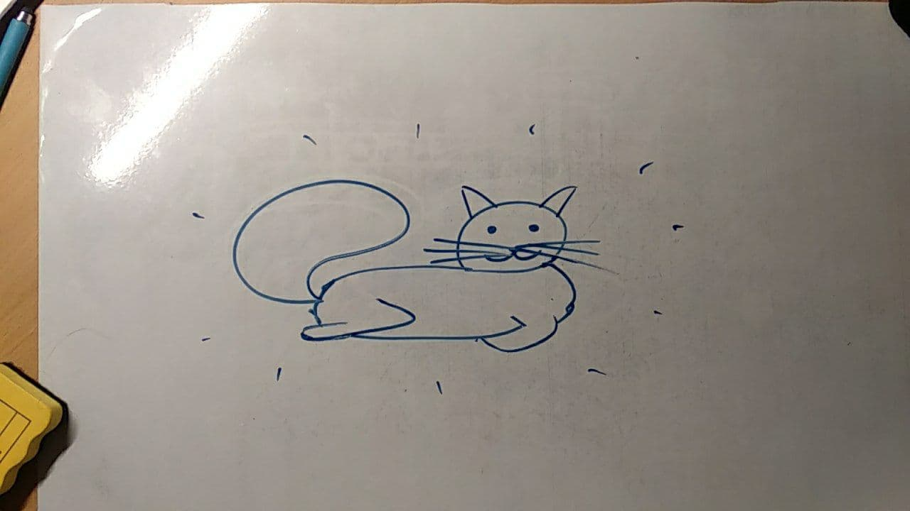
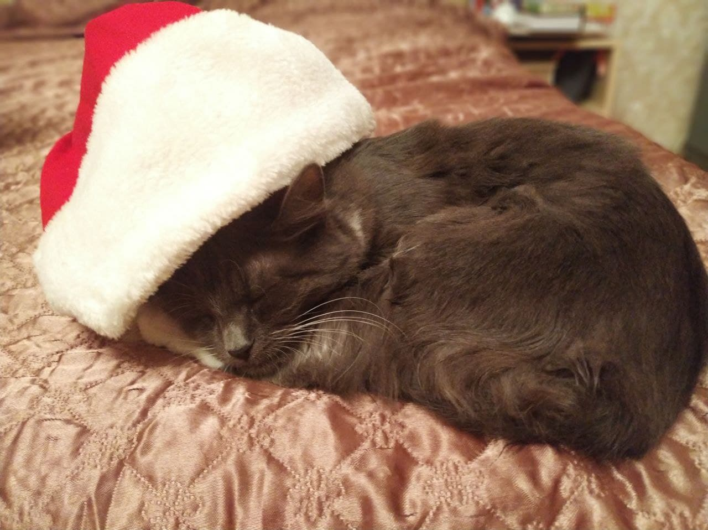

# So


> будет хорошо, если вы выздоровеете, потому что это приятно и вы нужны. Желаю приятного выздоровления
>
> и много благодарностей за курс проги
>
> и с новым годом
>
> и вообще
> 
>
> *~Аня фи-01*


> выздоравливайте скорее! мы вас очень любим и ждем обратно! :3 
> ```
>  ^--^   /\/\
>  \  /   \  /  *шлем лучей любви и котиков*
>  /  \    \/
> |    |
> ~ // ~
>   \\
>   \/
> ```
> *~Маша Ч., ФИ-02*


> добавлю сюда уже знакомого вам котека
> 
> 
> 
> *~Миша*


>Поправляйтесь, мы вас очень ждём <3
>
>*Тут должен быть красивый котик, но рисовать я не умею :)*
>
>*~Петя, ФИ-03*

> Всё как всегда достаточно плохо, но пусть у вас всё будет хорошо :)
> *~Матвей*

>Желаю вам скорейшего выздоровления! Вас ждёт большое количество проектов и ещё большее количество студентов
>
>
>
>До скорой встречи!

> пусть каждый день будет, как котик - мурчащим от удовольствия, добрым и веселым. ПУСТЬ!
>
> 
>
> *~Светлана*

> *~ Максим Намчук Фи-02 *
>```c++
> #include <iostream>
> using namespace std;
> int main() {
>  cout << "Выздоравливайте скорее)";
> }
> ```


> **Вы абсолютно и точно сделали этот мир, и нас, лучше. Bыздоравливайте быстрее! Вы нам нужны и важны!** <br>
> ~ Dima_Kyrychkov

>Поправляйтесь, вы нам ещё нужны)))
>```c#
>using System;
>class MainClass {
> public static void Main (string[] args) {
>   Console.WriteLine ("Красивая картинка кота");
> }
>}
> ```
> *~опция, фи-01~*

>
>
> Людмило Вікторівно, партія котів минулорічного першого курсу рада пройшла курс програмування, і ще не менш рада буде пройти з Вами декілька курсів у майбутньому!
> Розумні і красиві коти груп ФІ-9Х прагнуть чимшвидше побачити/почути Вас знову! 
> Сумуємо за Вами!
> Мур!
>
>```
>             *    .MMM8&&&.            *
>                 MMMM88&&&&&    .
>                MMMM88&&&&&&&
>    *           MMM88&&&&&&&&
>                MMM88&&&&&&&&
>                'MMM88&&&&&&'
>                  'MMM8&&&'      *
>          |\_/|
>         )     (             .              '
>        =\     /=
>          )===(       *
>         /     \
>         |     |
>        /       \
>        \       /
> _/\_/\_/\__  _/_/\_/\_/\_/\_/\_/\_/\_/\_/\_
> |  |  |  |( (  |  |  |  |  |  |  |  |  |  |
> |  |  |  | ) ) |  |  |  |  |  |  |  |  |  |
> |  |  |  |(_(  |  |  |  |  |  |  |  |  |  |
> |  |  |  |  |  |  |  |  |  |  |  |  |  |  |
> |  |  |  |  |  |  |  |  |  |  |  |  |  |  |
>```
>
>

> Скорейшего выздоровления. Говорят, коты лечат людей, а у вас таких котов несколько потоков. Все будет хорошо)
>```
>  |\---/|
>  | o_o |
>   \_V_/
> Кот улыбается, и вы улыбайтесь)
>```
> *~ Эдик*


> Вітаю! Дізнався, що у вас сталися негаразди зі здоров'ям. 
> Вірю у ваші сили. Бажаю вам вірити в свої сили щиріше ніж будь-хто. Та пам'ятати заради чого варто одужувати і жити далі, якщо у вас є заради чого. 
> Якщо ж здається, що немає - то тільки здається. І тоді бажаю знайти цю цінність, та твердо про неї пам'ятати. 
> 
> І не знаю коли випаде нагода розповісти вам про це особисто, тому напишу зараз: 
> Ми 4 роки тому в ліцеї багато обговорювали з вами баланс дисципліни та мотивації, і мені чомусь здавалося, що дисципліна це обов'язково примус.
> А ви казали, що з вашого боку ніякого примусу не буде. Мені здавалося, що примус таки потрібен для того, щоб діяти настільки ефективно та доцільно, наскільки це можливо. Бо будь-яка мотивація начебто швидко розсіюється та втрачає ефективність.
> Так от, з часом виявилося, що ви були значно ближче до емпіричної правди - примус розвіюється і втрачає ефективність не менше будь-якої мотивації, при тому нерідко залишаючи по собі нищівні наслідки. 
> Виявилося, що кращий спосіб діяти певним чином - відчувати, що не діяти так неможливо. А все інше то таке. Декорації.
> 
> Так от, дякую за всі уроки, які ви дали мені та моїм колегам-однокласникам. Дякую за ці розмови про різні матерії. 
> Бажаю сил, наснаги, радості та спокою. 
>
> *~ Богдан М*


>Привіт з ІПСА! Так, так. Це вже як з іншого куточка світу :)
>Шкода, що почався карантин і можливість виловити Вас та розповісти як Ви вплинули на життя і подякувати Вам не з'явилася (поки що).
>Але ж дійсно вплинули, і в кращу сторону. На ІПСА підштовхнули Ви. На волонтерство --- Ви. 
>І все це круто і добре. З відчуттям, що все так як і має бути.
>Дякую. Люблю. Цілую.
>*~Ваша Ліза*
